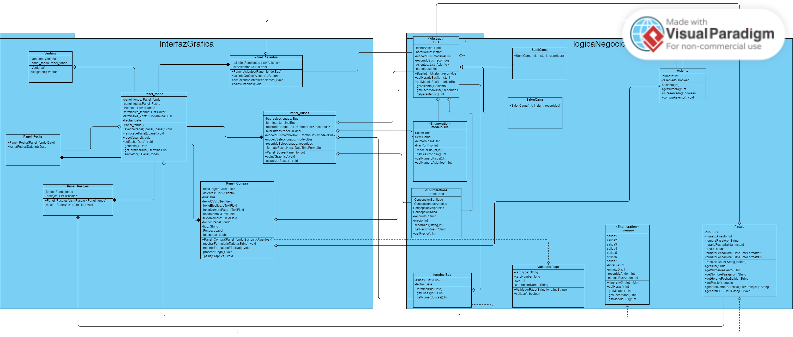
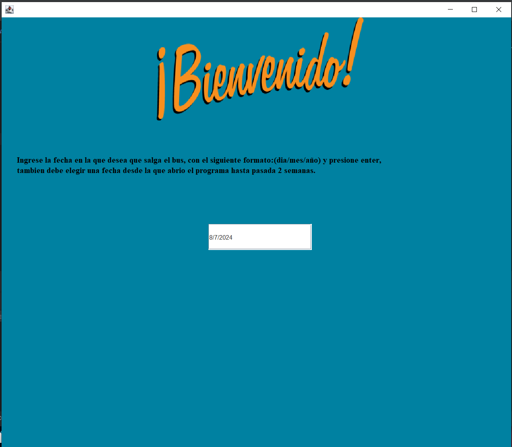
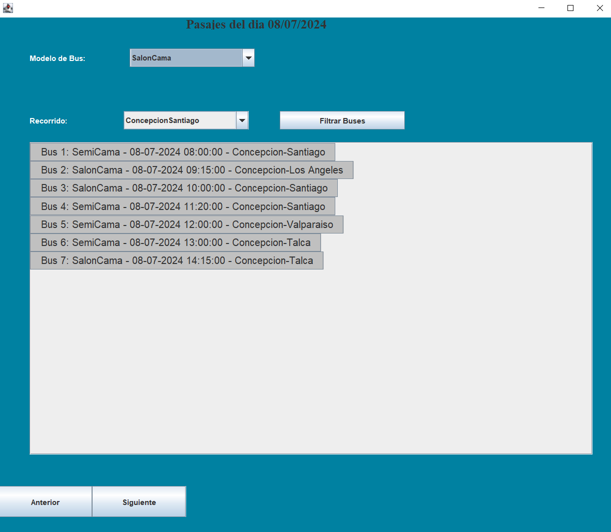
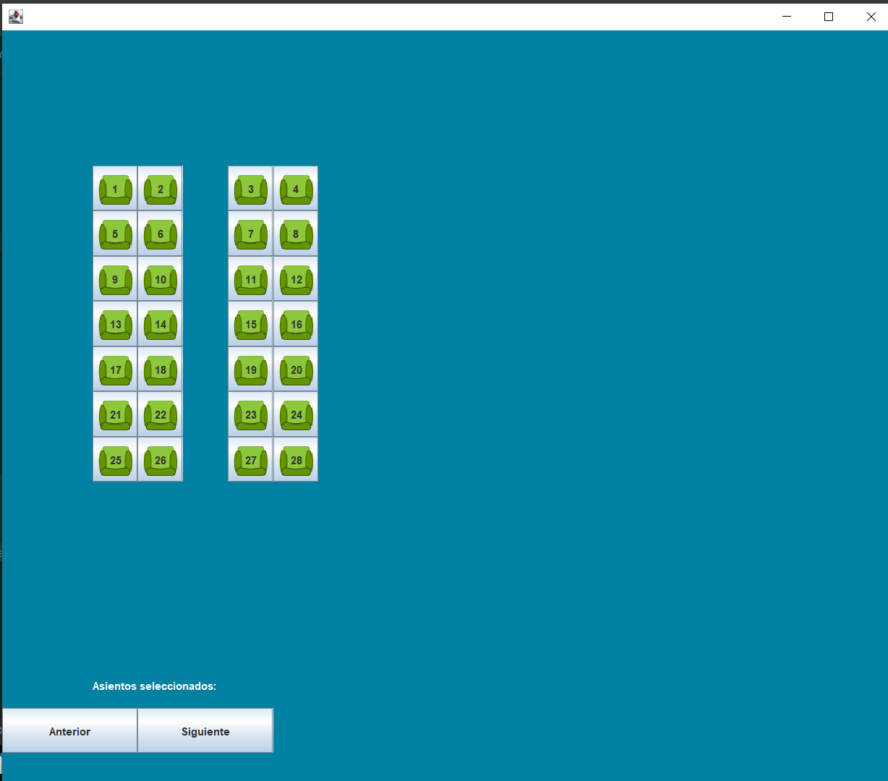
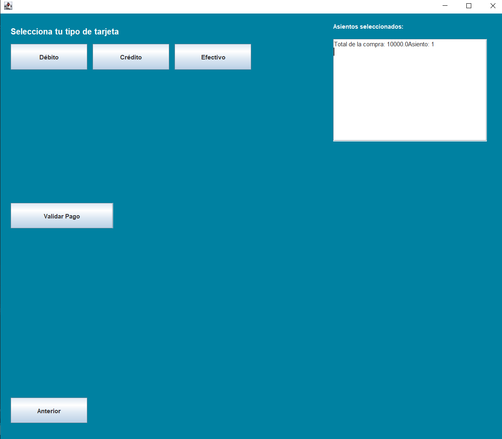
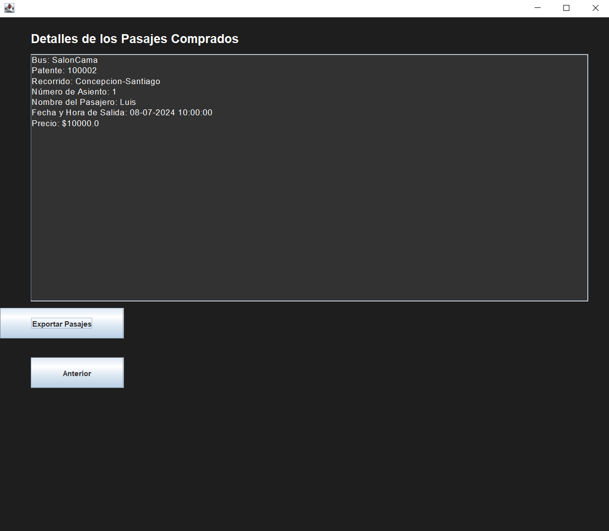

# Proyecto Final Grupo 2 - Desarrollo Orientado a Objeto
Integrantes: Luis Ignacio Martinez Neira, Santiago Alexander Díaz Barra y Mario Andres Salgado Jaque.
## Enunciado
Tema 2: Sistema de reserva de asientos de autobús

El sistema de reserva de asientos de autobús permite al personal de una empresa de autobús elegir y reservar asientos de forma conveniente por su cliente. Los usuarios pueden  visualizar una representación gráfica de los asientos disponibles en el autobús y seleccionar los que deseen ocupar. El sistema muestra información detallada sobre cada asiento, como su ubicación, número y  categoría (por ejemplo, semi cama, Salón Cama).

Una vez que los usuarios seleccionan los asientos deseados, el sistema verifica la disponibilidad y permite confirmar la reserva mostrando el precio a pagar. En caso de que algún asiento ya esté reservado por otro pasajero, se informa al usuario para que pueda elegir otro asiento disponible. El personal confirma el pago (no gestionado por el sistema) lo que reserva los asientos.

El sistema debe gestionar varios tipos de autobuses (por ejemplo, con diferente número de plazas, o de 1 o 2 pisos...).

El sistema debe mostrar un menú que permita seleccionar el autobús en función de su horario y recorrido (se supone que estos datos están disponibles con los autobuses vacíos cuando se lanza el software)
## Diagrama UML

## Diagrama de casos de uso

## Patrones utilizados
Se utilizaron los patrones singleton y Holder.

El patrón Holder se utilizó en la clase Panel_fondo, que fue utilizada a lo largo de todos los paneles del programa para almacenar información critica sobre la ejecución como los terminales de Buses y la fecha con la que se está trabajando, además de manejar el pase entre un panel y otro.

Como este panel es utilizado de esa forma, creímos que debía ser único. Para eso utilizamos el patrón Singleton, que nos permite hacer que una clase tenga una única instancia y que sólo manejemos una referencia de ella. También utilizamos el patrón Singleton en la clase Ventana, que es única y solo debe existir una durante toda la ejecución del programa.
## Información clave sobre la ejecución
En el panel de Compra se requiere una autorización para poder confirmar el Efectivo ingresado, es por esto que debe ingresarse un código o clave de cajero, la cual está definida como 212378.

También existen opciones de pago con Débito y Crédito, lo cual se puede probar con números de tarjeta ficticios de 16 digitos, por ejemplo 4120030334339912.

## Interfaz

## Decisiones
Durante nuestro proceso para realizar el proyecto podemos destacar las siguientes:

-Para más simplicidad decidimos usar solo 2 tipos de buses que fueron el Saloncama y Semicama.

-Limitamos las posibles fechas seleccionables a solo 2 semanas, desde que se inicia el programa.

-Utilizamos un solo tipo de asiento porque cada bus tendra todos sus asientos iguales.

-Agregamos como funcionalidad adicional exportar los pasajes comprados como pdf, lo que implica el uso de una dependencia adicional.

-Definimos Enums para valores constantes que dependen del entorno en el entorno que se use el programa, como los recorridos, los modelos de buses y el itinerario.
## Conclusiones
Planteamos durante el desarrollo del proyecto las posibles soluciones a los diversos obstáculos que se nos cruzaron a la hora de desarrollar el código, tales como, ¿cómo podemos hacer que al momento de comprar un asiento, al volver a comprar en el mismo se siga manteniendo el estado de compra del asiento?, ¿cómo limitar la cantidad de fechas que se podran seleccionar?, ¿cómo guardaremos de manera óptima los datos de los buses?, ¿cómo podemos hacer que al ingresar distintas fechas en la ejecución se mantengan instancias de información de días distintos?, ¿cómo podemos hacer que valores constantes como los itinerarios y modelos de bus estén accesibles a todo momento?

Para resolverlos, utilizamos las distintas capacidades del lenguaje de programación Java, incluyendo elementos ArrayList, enumeraciones y otros tipos de Objetos y Clases que nos ayudaron a hacer realidad este proyecto.

Además, creímos que una funcionalidad importante sería el poder obtener un elemento tangible que pruebe la venta, por lo que implementamos como funcionalidad adicional la posibilidad de exportar los distintos pasajes comprados en formato PDF.

Creemos que este proyecto fue un gran aporte para mejorar aún más nuestras habilidades en la programación, una de las disciplinas más importantes como ingeniero civil informatico, además de darnos experiencia que sabemos que nos será de gran utilidad para nuestros cursos futuros en la carrera.
